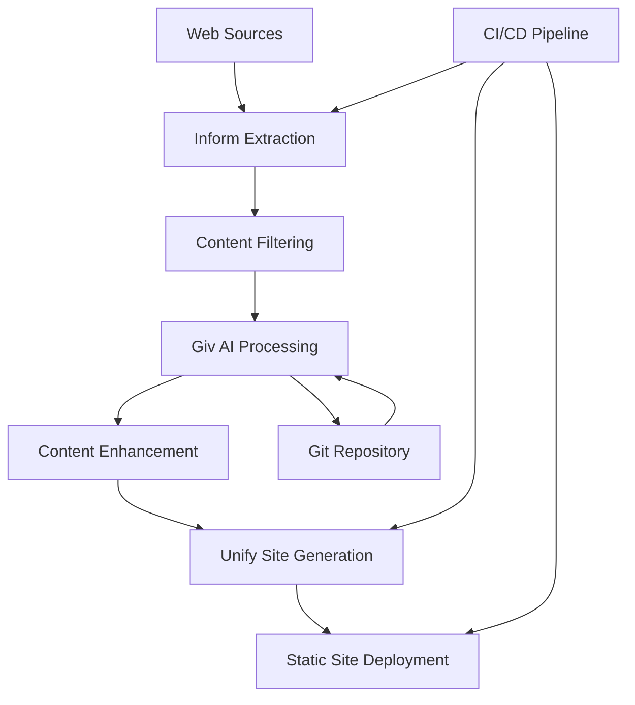

# Building a Unified Workflow with Giv, Unify, and Inform

## Introduction

The complete fwdslsh ecosystem combines three powerful tools to create an end-to-end content pipeline that transforms web-based content into polished documentation websites with AI-enhanced workflows. This comprehensive integration leverages Inform for intelligent content extraction, Giv for AI-powered Git workflow management, and Unify for modern static site generation.

### End-to-End Content Pipeline Overview

The unified workflow creates a seamless pipeline that:

1. **Discovers and Extracts** content from multiple web sources using Inform
2. **Processes and Enhances** content with AI-powered analysis using Giv
3. **Transforms and Publishes** content as modern static sites using Unify
4. **Automates and Monitors** the entire process with intelligent workflows

This integration is ideal for:
- **Documentation Teams** managing multiple external content sources
- **Developer Relations** building comprehensive developer portals
- **Content Operations** maintaining large-scale knowledge bases
- **Marketing Teams** creating content-driven websites with automated updates

### Business Value and Use Cases

**Developer Documentation Portal**: Aggregate API docs from multiple services, enhance with AI summaries, and publish as a unified developer experience.

**Knowledge Base Automation**: Extract content from support sites, wikis, and forums, then structure and publish as searchable documentation.

**Competitive Intelligence**: Monitor competitor documentation, extract key insights, and maintain internal knowledge bases.

**Content Migration**: Move content from legacy systems to modern static sites with AI-enhanced processing and quality control.

**Multi-Source Aggregation**: Combine content from various sources into cohesive, well-structured documentation sites.

### Architecture Overview



The architecture ensures:
- **Scalable Processing**: Handle large volumes of content efficiently
- **Quality Control**: Multiple validation and enhancement stages
- **Automated Workflows**: Minimal manual intervention required
- **Flexible Output**: Adaptable to various documentation formats and styles

## Pipeline Design

### Content Sources and Extraction Planning

Design a comprehensive content extraction strategy:

```bash
# Create project structure for unified workflow
mkdir unified-content-pipeline
cd unified-content-pipeline

# Set up directory structure
mkdir -p {config,sources,extracted,filtered,enhanced,site,deploy}
mkdir -p {scripts,templates,reports,logs}

# Create master configuration for all sources
cat > config/sources.config.js << 'EOF'
export default {
  sources: [
    {
      name: 'api-documentation',
      type: 'api-docs',
      priority: 'critical',
      schedule: '0 */6 * * *', // Every 6 hours
      inform: {
        baseUrl: 'https://api-docs.example.com',
        paths: ['/reference/', '/guides/', '/tutorials/'],
        selectors: {
          title: 'h1, .page-title',
          content: '.content, main, article',
          lastModified: '.last-modified, time'
        },
        filters: {
          minLength: 200,
          excludePatterns: ['navigation', 'footer', 'sidebar']
        }
      }
    },
    {
      name: 'community-content',
      type: 'community',
      priority: 'medium',
      schedule: '0 3 * * *', // Daily at 3 AM
      inform: {
        baseUrl: 'https://community.example.com',
        paths: ['/docs/', '/wiki/', '/help/'],
        selectors: {
          title: 'h1.topic-title',
          content: '.post-content',
          author: '.author-info'
        },
        filters: {
          minLength: 150,
          requireApproval: true
        }
      }
    },
    {
      name: 'vendor-documentation',
      type: 'vendor-docs',
      priority: 'high',
      schedule: '0 2 * * *', // Daily at 2 AM
      inform: {
        baseUrl: 'https://docs.vendor.com',
        paths: ['/integration/', '/api/', '/guides/'],
        authentication: {
          type: 'api-key',
          header: 'X-API-Key'
        },
        selectors: {
          title: 'h1',
          content: '.documentation-content',
          version: '.version-info'
        }
      }
    },
    {
      name: 'support-knowledge',
      type: 'support',
      priority: 'low',
      schedule: '0 4 * * 0', // Weekly on Sunday
      inform: {
        baseUrl: 'https://support.example.com',
        paths: ['/kb/', '/faq/', '/troubleshooting/'],
        selectors: {
          title: '.kb-title',
          content: '.kb-content',
          category: '.kb-category'
        },
        filters: {
          categories: ['technical', 'integration', 'development']
        }
      }
    }
  ],
  
  globalSettings: {
    respectRobots: true,
    rateLimit: 1000,
    userAgent: 'UnifiedContentPipeline/1.0',
    timeout: 30000,
    retries: 3
  },
  
  processing: {
    enableAI: true,
    qualityThreshold: 0.7,
    deduplication: true,
    contentEnrichment: true
  }
}
EOF

# Create extraction orchestrator
cat > scripts/extract-all-sources.js << 'EOF'
const fs = require('fs');
const path = require('path');
const { execSync } = require('child_process');
const config = require('../config/sources.config.js').default;

class ExtractionOrchestrator {
    constructor() {
        this.logFile = `logs/extraction-${Date.now()}.log`;
        this.results = {
            started: new Date().toISOString(),
            sources: [],
            summary: {
                totalSources: 0,
                successful: 0,
                failed: 0,
                totalFiles: 0
            }
        };
    }

    async extractAllSources() {
        console.log('🚀 Starting unified content extraction...');
        this.log('Starting unified content extraction');
        
        this.results.summary.totalSources = config.sources.length;
        
        for (const source of config.sources) {
            try {
                console.log(`📥 Processing source: ${source.name} (${source.type})`);
                const result = await this.extractSource(source);
                
                this.results.sources.push({
                    name: source.name,
                    type: source.type,
                    status: 'success',
                    filesExtracted: result.files,
                    duration: result.duration,
                    timestamp: new Date().toISOString()
                });
                
                this.results.summary.successful++;
                this.results.summary.totalFiles += result.files;
                
                console.log(`✅ ${source.name}: ${result.files} files extracted in ${result.duration}ms`);
                
            } catch (error) {
                console.error(`❌ Failed to extract ${source.name}:`, error.message);
                this.log(`ERROR: ${source.name} - ${error.message}`);
                
                this.results.sources.push({
                    name: source.name,
                    type: source.type,
                    status: 'failed',
                    error: error.message,
                    timestamp: new Date().toISOString()
                });
                
                this.results.summary.failed++;
            }
        }
        
        // Generate extraction report
        await this.generateExtractionReport();
        
        console.log(`🏁 Extraction complete: ${this.results.summary.successful}/${this.results.summary.totalSources} sources, ${this.results.summary.totalFiles} total files`);
    }

    async extractSource(source) {
        const startTime = Date.now();
        
        // Create source-specific extraction configuration
        const extractConfig = {
            name: source.name,
            baseUrl: source.inform.baseUrl,
            paths: source.inform.paths,
            selectors: source.inform.selectors,
            filters: source.inform.filters,
            outputDir: `extracted/${source.name}/`,
            ...config.globalSettings
        };
        
        // Run Inform extraction
        const configFile = `config/temp-${source.name}-${Date.now()}.json`;
        fs.writeFileSync(configFile, JSON.stringify(extractConfig, null, 2));
        
        try {
            execSync(`inform extract --config ${configFile}`, { 
                stdio: 'pipe',
                encoding: 'utf8'
            });
            
            // Count extracted files
            const filesCount = this.countExtractedFiles(`extracted/${source.name}/`);
            
            // Clean up temp config
            fs.unlinkSync(configFile);
            
            return {
                files: filesCount,
                duration: Date.now() - startTime
            };
            
        } catch (error) {
            // Clean up temp config on error
            if (fs.existsSync(configFile)) {
                fs.unlinkSync(configFile);
            }
            throw error;
        }
    }

    countExtractedFiles(dir) {
        try {
            if (!fs.existsSync(dir)) return 0;
            
            const count = execSync(`find ${dir} -name "*.md" | wc -l`, { encoding: 'utf8' });
            return parseInt(count.trim()) || 0;
        } catch {
            return 0;
        }
    }

    async generateExtractionReport() {
        const report = {
            metadata: {
                generated: new Date().toISOString(),
                pipeline: 'unified-content-extraction',
                version: '1.0'
            },
            summary: this.results.summary,
            sources: this.results.sources,
            recommendations: this.generateRecommendations()
        };
        
        // Save JSON report
        const jsonReportPath = `reports/extraction-${Date.now()}.json`;
        fs.writeFileSync(jsonReportPath, JSON.stringify(report, null, 2));
        
        // Generate markdown report
        const markdownReport = this.generateMarkdownReport(report);
        const mdReportPath = `reports/extraction-${Date.now()}.md`;
        fs.writeFileSync(mdReportPath, markdownReport);
        
        console.log(`📊 Reports generated: ${jsonReportPath}, ${mdReportPath}`);
    }

    generateRecommendations() {
        const recommendations = [];
        
        if (this.results.summary.failed > 0) {
            recommendations.push('Review failed extractions and update source configurations');
        }
        
        if (this.results.summary.totalFiles < 10) {
            recommendations.push('Consider adding more content sources or adjusting filters');
        }
        
        const avgFilesPerSource = this.results.summary.totalFiles / this.results.summary.successful;
        if (avgFilesPerSource < 5) {
            recommendations.push('Low content volume detected - verify source configurations and selectors');
        }
        
        return recommendations;
    }

    generateMarkdownReport(report) {
        return `# Content Extraction Report

**Generated**: ${report.metadata.generated}  
**Pipeline**: ${report.metadata.pipeline}  

## Summary

- **Total Sources**: ${report.summary.totalSources}
- **Successful**: ${report.summary.successful}
- **Failed**: ${report.summary.failed}
- **Total Files Extracted**: ${report.summary.totalFiles}
- **Success Rate**: ${((report.summary.successful / report.summary.totalSources) * 100).toFixed(1)}%

## Source Details

${report.sources.map(source => `
### ${source.name} (${source.type})

- **Status**: ${source.status === 'success' ? '✅ Success' : '❌ Failed'}
- **Files**: ${source.filesExtracted || 0}
- **Duration**: ${source.duration || 'N/A'}ms
${source.error ? `- **Error**: ${source.error}` : ''}
`).join('\n')}

## Recommendations

${report.recommendations.map(rec => `- ${rec}`).join('\n')}

---
*Report generated automatically by unified content pipeline*
`;
    }

    log(message) {
        const timestamp = new Date().toISOString();
        const logEntry = `${timestamp} - ${message}\n`;
        fs.appendFileSync(this.logFile, logEntry);
    }
}

// Execute extraction
async function main() {
    const orchestrator = new ExtractionOrchestrator();
    await orchestrator.extractAllSources();
}

main().catch(console.error);
EOF
```

### Processing and Transformation Stages

Implement comprehensive content processing pipeline:

```bash
# Create processing pipeline
cat > scripts/processing-pipeline.js << 'EOF'
const fs = require('fs');
const path = require('path');
const { execSync } = require('child_process');

class ProcessingPipeline {
    constructor() {
        this.stages = [
            { name: 'quality-filter', handler: this.qualityFilter.bind(this) },
            { name: 'ai-enhancement', handler: this.aiEnhancement.bind(this) },
            { name: 'content-structuring', handler: this.contentStructuring.bind(this) },
            { name: 'deduplication', handler: this.deduplication.bind(this) },
            { name: 'metadata-enrichment', handler: this.metadataEnrichment.bind(this) }
        ];
        
        this.metrics = {
            totalFiles: 0,
            processedFiles: 0,
            filteredFiles: 0,
            enhancedFiles: 0,
            duplicatesRemoved: 0,
            processingTime: 0
        };
    }

    async processAllContent() {
        console.log('🔄 Starting content processing pipeline...');
        const startTime = Date.now();
        
        // Count initial files
        this.metrics.totalFiles = this.countFiles('extracted/');
        console.log(`📊 Processing ${this.metrics.totalFiles} extracted files`);
        
        // Run each processing stage
        for (const stage of this.stages) {
            try {
                console.log(`🔧 Running stage: ${stage.name}`);
                await stage.handler();
                console.log(`✅ Completed stage: ${stage.name}`);
            } catch (error) {
                console.error(`❌ Failed stage: ${stage.name} - ${error.message}`);
                throw error;
            }
        }
        
        this.metrics.processingTime = Date.now() - startTime;
        
        // Generate processing report
        await this.generateProcessingReport();
        
        console.log(`🏁 Processing pipeline complete in ${this.metrics.processingTime}ms`);
    }

    async qualityFilter() {
        // Apply quality filters to extracted content
        const extractedFiles = this.getAllMarkdownFiles('extracted/');
        
        for (const file of extractedFiles) {
            const content = fs.readFileSync(file, 'utf8');
            const quality = this.assessContentQuality(content);
            
            if (quality.score >= 0.7) {
                // Copy to filtered directory
                const relativePath = path.relative('extracted/', file);
                const filteredPath = path.join('filtered/', relativePath);
                const filteredDir = path.dirname(filteredPath);
                
                if (!fs.existsSync(filteredDir)) {
                    fs.mkdirSync(filteredDir, { recursive: true });
                }
                
                // Add quality metadata
                const enhancedContent = this.addQualityMetadata(content, quality);
                fs.writeFileSync(filteredPath, enhancedContent);
                this.metrics.filteredFiles++;
            }
        }
        
        console.log(`  📋 Quality filter: ${this.metrics.filteredFiles}/${extractedFiles.length} files passed`);
    }

    async aiEnhancement() {
        // Use Giv to enhance content with AI
        const filteredFiles = this.getAllMarkdownFiles('filtered/');
        
        for (const file of filteredFiles) {
            try {
                // Generate AI summary and enhancements
                const tempFile = `/tmp/content-${Date.now()}.md`;
                fs.copyFileSync(file, tempFile);
                
                const summary = execSync(`giv summarize --file "${tempFile}" --prompt content-summary`, 
                    { encoding: 'utf8', timeout: 30000 });
                
                const enhanced = execSync(`giv enhance --file "${tempFile}" --prompt structured-docs`, 
                    { encoding: 'utf8', timeout: 45000 });
                
                // Save enhanced content
                const relativePath = path.relative('filtered/', file);
                const enhancedPath = path.join('enhanced/', relativePath);
                const enhancedDir = path.dirname(enhancedPath);
                
                if (!fs.existsSync(enhancedDir)) {
                    fs.mkdirSync(enhancedDir, { recursive: true });
                }
                
                const originalContent = fs.readFileSync(file, 'utf8');
                const combinedContent = this.combineEnhancements(originalContent, summary, enhanced);
                fs.writeFileSync(enhancedPath, combinedContent);
                
                // Clean up
                fs.unlinkSync(tempFile);
                this.metrics.enhancedFiles++;
                
            } catch (error) {
                console.warn(`  ⚠️ AI enhancement failed for ${path.basename(file)}: ${error.message}`);
            }
        }
        
        console.log(`  🤖 AI enhancement: ${this.metrics.enhancedFiles}/${filteredFiles.length} files enhanced`);
    }

    async contentStructuring() {
        // Structure content for Unify consumption
        const enhancedFiles = this.getAllMarkdownFiles('enhanced/');
        
        for (const file of enhancedFiles) {
            const content = fs.readFileSync(file, 'utf8');
            const structured = this.structureForUnify(content);
            
            // Create Unify-compatible structure
            const relativePath = path.relative('enhanced/', file);
            const structuredPath = path.join('site/src/content/', relativePath);
            const structuredDir = path.dirname(structuredPath);
            
            if (!fs.existsSync(structuredDir)) {
                fs.mkdirSync(structuredDir, { recursive: true });
            }
            
            fs.writeFileSync(structuredPath, structured);
            this.metrics.processedFiles++;
        }
        
        console.log(`  📄 Content structuring: ${this.metrics.processedFiles} files structured for Unify`);
    }

    async deduplication() {
        // Remove duplicate content
        const contentFiles = this.getAllMarkdownFiles('site/src/content/');
        const contentHashes = new Map();
        let duplicatesFound = 0;
        
        for (const file of contentFiles) {
            const content = fs.readFileSync(file, 'utf8');
            const normalizedContent = content.replace(/^---[\s\S]*?---\n/, '').replace(/\s+/g, ' ').trim();
            const hash = require('crypto').createHash('sha256').update(normalizedContent).digest('hex');
            
            if (contentHashes.has(hash)) {
                // Duplicate found - move to duplicates folder
                const duplicatesDir = 'site/duplicates/';
                if (!fs.existsSync(duplicatesDir)) {
                    fs.mkdirSync(duplicatesDir, { recursive: true });
                }
                
                const duplicateName = path.basename(file);
                fs.renameSync(file, path.join(duplicatesDir, duplicateName));
                duplicatesFound++;
            } else {
                contentHashes.set(hash, file);
            }
        }
        
        this.metrics.duplicatesRemoved = duplicatesFound;
        console.log(`  🔍 Deduplication: ${duplicatesFound} duplicates removed`);
    }

    async metadataEnrichment() {
        // Enrich content with additional metadata for Unify
        const contentFiles = this.getAllMarkdownFiles('site/src/content/');
        
        for (const file of contentFiles) {
            const content = fs.readFileSync(file, 'utf8');
            const enriched = this.enrichMetadata(content, file);
            fs.writeFileSync(file, enriched);
        }
        
        console.log(`  📊 Metadata enrichment: ${contentFiles.length} files enriched`);
    }

    assessContentQuality(content) {
        let score = 0.5; // Base score
        
        // Word count check
        const wordCount = content.split(/\s+/).length;
        if (wordCount > 100) score += 0.2;
        if (wordCount > 500) score += 0.1;
        
        // Structure check
        const headingCount = (content.match(/^#{1,6}\s/gm) || []).length;
        if (headingCount > 1) score += 0.1;
        
        // Code examples
        if (content.includes('```')) score += 0.1;
        
        return { score: Math.min(score, 1.0), wordCount, headingCount };
    }

    addQualityMetadata(content, quality) {
        const metadata = `---
qualityScore: ${quality.score.toFixed(2)}
wordCount: ${quality.wordCount}
headingCount: ${quality.headingCount}
processedDate: ${new Date().toISOString()}
---

`;

        if (content.startsWith('---\n')) {
            const frontmatterEnd = content.indexOf('\n---\n', 4);
            if (frontmatterEnd !== -1) {
                const existingFrontmatter = content.slice(4, frontmatterEnd);
                const body = content.slice(frontmatterEnd + 5);
                
                return `---
${existingFrontmatter}
qualityScore: ${quality.score.toFixed(2)}
processedDate: ${new Date().toISOString()}
---${body}`;
            }
        }
        
        return metadata + content;
    }

    combineEnhancements(original, summary, enhanced) {
        return `---
aiProcessed: true
processedDate: ${new Date().toISOString()}
hasAiSummary: true
hasStructuredVersion: true
---

# Enhanced Content

## AI Summary

${summary}

## Structured Content

${enhanced}

## Original Content

${original}`;
    }

    structureForUnify(content) {
        // Transform content for optimal Unify consumption
        const lines = content.split('\n');
        const metadata = this.extractMetadata(content);
        
        // Ensure proper frontmatter for Unify
        let frontmatter = `---
title: "${metadata.title || 'Untitled'}"
description: "${metadata.description || 'Content from unified pipeline'}"
layout: "docs"
date: ${new Date().toISOString()}
tags: ${JSON.stringify(metadata.tags || [])}
category: "${metadata.category || 'general'}"
source: "${metadata.source || 'extracted'}"
---

`;

        // Extract body content (remove existing frontmatter)
        let body = content;
        if (content.startsWith('---\n')) {
            const frontmatterEnd = content.indexOf('\n---\n', 4);
            if (frontmatterEnd !== -1) {
                body = content.slice(frontmatterEnd + 5);
            }
        }

        return frontmatter + body;
    }

    enrichMetadata(content, filePath) {
        const metadata = this.extractMetadata(content);
        const relativePath = path.relative('site/src/content/', filePath);
        const category = path.dirname(relativePath);
        
        // Add additional metadata
        metadata.slug = path.basename(filePath, '.md');
        metadata.category = metadata.category || category;
        metadata.lastModified = new Date().toISOString();
        metadata.contentType = this.detectContentType(content);
        
        // Rebuild frontmatter
        const frontmatterLines = Object.entries(metadata).map(([key, value]) => {
            if (Array.isArray(value)) {
                return `${key}: ${JSON.stringify(value)}`;
            } else if (typeof value === 'string' && value.includes(':')) {
                return `${key}: "${value}"`;
            }
            return `${key}: ${value}`;
        });
        
        const newFrontmatter = `---\n${frontmatterLines.join('\n')}\n---\n\n`;
        
        // Extract body
        let body = content;
        if (content.startsWith('---\n')) {
            const frontmatterEnd = content.indexOf('\n---\n', 4);
            if (frontmatterEnd !== -1) {
                body = content.slice(frontmatterEnd + 5);
            }
        }
        
        return newFrontmatter + body;
    }

    extractMetadata(content) {
        const metadata = {};
        
        if (content.startsWith('---\n')) {
            const frontmatterEnd = content.indexOf('\n---\n', 4);
            if (frontmatterEnd !== -1) {
                const frontmatter = content.slice(4, frontmatterEnd);
                frontmatter.split('\n').forEach(line => {
                    const [key, ...valueParts] = line.split(':');
                    if (key && valueParts.length > 0) {
                        let value = valueParts.join(':').trim();
                        value = value.replace(/^["']|["']$/g, ''); // Remove quotes
                        metadata[key.trim()] = value;
                    }
                });
            }
        }
        
        return metadata;
    }

    detectContentType(content) {
        if (content.includes('API') || content.includes('endpoint')) return 'api-reference';
        if (content.includes('tutorial') || content.includes('step')) return 'tutorial';
        if (content.includes('guide') || content.includes('how to')) return 'guide';
        if (content.includes('troubleshooting') || content.includes('error')) return 'troubleshooting';
        return 'documentation';
    }

    countFiles(dir) {
        try {
            const count = execSync(`find ${dir} -name "*.md" | wc -l`, { encoding: 'utf8' });
            return parseInt(count.trim()) || 0;
        } catch {
            return 0;
        }
    }

    getAllMarkdownFiles(dir) {
        const files = [];
        
        function scan(currentDir) {
            if (!fs.existsSync(currentDir)) return;
            
            const items = fs.readdirSync(currentDir, { withFileTypes: true });
            
            for (const item of items) {
                const fullPath = path.join(currentDir, item.name);
                
                if (item.isDirectory()) {
                    scan(fullPath);
                } else if (item.name.endsWith('.md')) {
                    files.push(fullPath);
                }
            }
        }
        
        scan(dir);
        return files;
    }

    async generateProcessingReport() {
        const report = `# Content Processing Report

**Processing Date**: ${new Date().toISOString()}
**Processing Time**: ${this.metrics.processingTime}ms

## Processing Metrics

- **Total Extracted Files**: ${this.metrics.totalFiles}
- **Files Passed Quality Filter**: ${this.metrics.filteredFiles}
- **Files Enhanced with AI**: ${this.metrics.enhancedFiles}
- **Files Processed for Unify**: ${this.metrics.processedFiles}
- **Duplicates Removed**: ${this.metrics.duplicatesRemoved}

## Quality Metrics

- **Filter Pass Rate**: ${((this.metrics.filteredFiles / this.metrics.totalFiles) * 100).toFixed(1)}%
- **AI Enhancement Rate**: ${((this.metrics.enhancedFiles / this.metrics.filteredFiles) * 100).toFixed(1)}%
- **Overall Success Rate**: ${((this.metrics.processedFiles / this.metrics.totalFiles) * 100).toFixed(1)}%

## Pipeline Performance

- **Average Processing Time per File**: ${(this.metrics.processingTime / this.metrics.totalFiles).toFixed(0)}ms
- **Quality Control Efficiency**: ${this.metrics.filteredFiles > 0 ? 'Good' : 'Needs Review'}
- **AI Enhancement Coverage**: ${this.metrics.enhancedFiles > this.metrics.filteredFiles * 0.8 ? 'Excellent' : 'Good'}

## Next Steps

${this.metrics.processedFiles === 0 ? 
  '⚠️ No files processed successfully - review extraction and filtering configurations' :
  '✅ Processing completed successfully - ready for Unify site generation'
}

---
*Report generated automatically by processing pipeline*
`;

        const reportPath = `reports/processing-${Date.now()}.md`;
        fs.writeFileSync(reportPath, report);
        console.log(`📊 Processing report saved: ${reportPath}`);
    }
}

// Execute processing pipeline
async function main() {
    const pipeline = new ProcessingPipeline();
    await pipeline.processAllContent();
}

main().catch(console.error);
EOF
```

### Output and Deployment Targets

Configure Unify for optimal site generation:

```bash
# Create Unify site configuration
cat > site/unify.config.js << 'EOF'
export default {
  input: 'src',
  output: 'dist',
  
  // Site metadata
  site: {
    title: 'Unified Documentation Portal',
    description: 'Comprehensive documentation aggregated from multiple sources',
    url: process.env.SITE_URL || 'https://docs.example.com',
    author: 'Content Pipeline Team',
    language: 'en'
  },

  // Content processing
  content: {
    directory: 'src/content',
    collections: {
      docs: {
        pattern: '**/*.md',
        sortBy: 'date',
        reverse: true
      },
      apiReference: {
        pattern: 'api/**/*.md',
        sortBy: 'title'
      },
      tutorials: {
        pattern: 'tutorials/**/*.md',
        sortBy: 'difficulty'
      }
    }
  },

  // Markdown processing
  markdown: {
    highlightCode: true,
    generateToc: true,
    linkifyHeadings: true,
    plugins: [
      'markdown-it-container',
      'markdown-it-footnote',
      'markdown-it-deflist'
    ]
  },

  // SEO optimization
  seo: {
    generateSitemap: true,
    generateRobots: true,
    socialCards: true,
    metaTags: {
      'og:type': 'website',
      'twitter:card': 'summary_large_image'
    }
  },

  // Performance optimization
  performance: {
    minifyHTML: true,
    minifyCSS: true,
    minifyJS: true,
    optimizeImages: true,
    generateWebp: true,
    lazyLoadImages: true
  },

  // Documentation features
  features: {
    search: {
      enabled: true,
      provider: 'local', // or 'algolia'
      indexContent: true,
      includeExcerpts: true
    },
    navigation: {
      generateFromContent: true,
      maxDepth: 3,
      sortBy: 'order'
    },
    breadcrumbs: true,
    editOnGitHub: {
      enabled: true,
      repository: 'https://github.com/example/docs',
      branch: 'main'
    },
    lastModified: true,
    readingTime: true,
    contentRating: true
  },

  // Build optimization
  build: {
    parallel: true,
    cache: true,
    incremental: true,
    verbose: process.env.NODE_ENV === 'development'
  },

  // Development server
  serve: {
    port: 3000,
    host: 'localhost',
    livereload: true,
    watch: ['src/**/*', 'templates/**/*']
  }
}
EOF

# Create Unify site structure
mkdir -p site/src/{layouts,components,styles,scripts}

# Create main layout
cat > site/src/layouts/docs.html << 'EOF'
<!DOCTYPE html>
<html lang="{{ site.language }}">
<head>
    <meta charset="UTF-8">
    <meta name="viewport" content="width=device-width, initial-scale=1.0">
    <title>{{ title }} | {{ site.title }}</title>
    <meta name="description" content="{{ description || site.description }}">
    
    <!-- Open Graph / Facebook -->
    <meta property="og:type" content="article">
    <meta property="og:url" content="{{ site.url }}{{ url }}">
    <meta property="og:title" content="{{ title }}">
    <meta property="og:description" content="{{ description }}">
    
    <!-- Twitter -->
    <meta property="twitter:card" content="summary_large_image">
    <meta property="twitter:url" content="{{ site.url }}{{ url }}">
    <meta property="twitter:title" content="{{ title }}">
    <meta property="twitter:description" content="{{ description }}">
    
    <!-- Styles -->
    <link rel="stylesheet" href="/styles/main.css">
    <link rel="stylesheet" href="/styles/docs.css">
    <link rel="stylesheet" href="/styles/syntax.css">
    
    <!-- Favicon -->
    <link rel="icon" type="image/x-icon" href="/favicon.ico">
</head>
<body class="docs-layout">
    <!-- Header -->
    <header class="site-header">
        <nav class="main-nav">
            <div class="nav-container">
                <a href="/" class="site-logo">
                    
                    <span>{{ site.title }}</span>
                </a>
                
                <div class="nav-links">
                    <a href="/docs/">Documentation</a>
                    <a href="/api/">API Reference</a>
                    <a href="/tutorials/">Tutorials</a>
                    <a href="/guides/">Guides</a>
                </div>
                
                <div class="nav-actions">
                    <button class="search-toggle" aria-label="Toggle search">
                        <svg><!-- Search icon --></svg>
                    </button>
                    <button class="theme-toggle" aria-label="Toggle dark mode">
                        <svg><!-- Theme icon --></svg>
                    </button>
                </div>
            </div>
        </nav>
    </header>

    <div class="docs-container">
        <!-- Sidebar -->
        <aside class="docs-sidebar">
            <div class="sidebar-content">
                {{ include 'navigation.html' }}
            </div>
        </aside>

        <!-- Main content -->
        <main class="docs-main">
            <div class="docs-content">
                <!-- Breadcrumbs -->
                
                <nav class="breadcrumbs" aria-label="Breadcrumb">
                    
                    <a href="{{ crumb.url }}">{{ crumb.title }}</a>
                    <span class="breadcrumb-separator">→</span>
                    
                </nav>
                

                <!-- Article header -->
                <header class="article-header">
                    <h1 class="article-title">{{ title }}</h1>
                    
                    
                    <p class="article-description">{{ description }}</p>
                    
                    
                    <div class="article-meta">
                        
                        <span class="category">{{ category }}</span>
                        
                        
                        
                        <time class="last-modified" datetime="{{ lastModified }}">
                            Last updated: {{ lastModified | date }}
                        </time>
                        
                        
                        
                        <span class="reading-time">{{ readingTime }} min read</span>
                        
                    </div>
                    
                    
                    <div class="article-tags">
                        
                        <span class="tag">{{ tag }}</span>
                        
                    </div>
                    
                </header>

                <!-- Table of contents -->
                
                <nav class="table-of-contents">
                    <h2>Contents</h2>
                    {{ toc | safe }}
                </nav>
                

                <!-- Article content -->
                <article class="article-content">
                    {{ content }}
                </article>

                <!-- Article footer -->
                <footer class="article-footer">
                    
                    <a href="{{ editUrl }}" class="edit-link">
                        Edit this page on GitHub
                    </a>
                    
                    
                    
                    <div class="source-attribution">
                        <strong>Source:</strong> {{ source }}
                    </div>
                    
                    
                    <!-- Previous/Next navigation -->
                    {{ include 'pagination.html' }}
                </footer>
            </div>
        </main>

        <!-- Secondary sidebar -->
        <aside class="docs-toc">
            <div class="toc-content">
                
                <h3>On this page</h3>
                {{ toc | safe }}
                
            </div>
        </aside>
    </div>

    <!-- Search modal -->
    {{ include 'search.html' }}

    <!-- Scripts -->
    <script src="/scripts/main.js"></script>
    <script src="/scripts/docs.js"></script>
    <script src="/scripts/search.js"></script>
</body>
</html>
EOF

# Create site generation script
cat > scripts/generate-site.js << 'EOF'
const { execSync } = require('child_process');
const fs = require('fs');

async function generateUnifySite() {
    console.log('🏗️ Generating Unify site...');
    
    try {
        // Ensure we're in the site directory
        process.chdir('site');
        
        // Install dependencies if needed
        if (!fs.existsSync('node_modules')) {
            console.log('📦 Installing dependencies...');
            execSync('npm install', { stdio: 'inherit' });
        }
        
        // Generate search index
        console.log('🔍 Generating search index...');
        execSync('unify search:build', { stdio: 'inherit' });
        
        // Build the site
        console.log('🔨 Building site...');
        execSync('unify build --verbose', { stdio: 'inherit' });
        
        // Validate build
        console.log('✅ Validating build...');
        const distStats = fs.statSync('dist/index.html');
        if (distStats.size === 0) {
            throw new Error('Build produced empty index.html');
        }
        
        // Generate build report
        const buildReport = {
            timestamp: new Date().toISOString(),
            success: true,
            outputSize: execSync('du -sh dist/', { encoding: 'utf8' }).trim(),
            pageCount: execSync('find dist/ -name "*.html" | wc -l', { encoding: 'utf8' }).trim(),
            assetCount: execSync('find dist/ -type f | wc -l', { encoding: 'utf8' }).trim()
        };
        
        fs.writeFileSync('../reports/build-report.json', JSON.stringify(buildReport, null, 2));
        
        console.log(`🎉 Site built successfully!`);
        console.log(`   📊 ${buildReport.pageCount} pages generated`);
        console.log(`   📁 ${buildReport.assetCount} total files`);
        console.log(`   💾 ${buildReport.outputSize} total size`);
        
        // Return to parent directory
        process.chdir('..');
        
    } catch (error) {
        console.error('❌ Site generation failed:', error.message);
        process.chdir('..'); // Ensure we return to parent directory
        throw error;
    }
}

generateUnifySite().catch(console.error);
EOF
```

## Implementation Phase 1: Content Extraction

### Inform Configuration for Multiple Sources

Set up comprehensive source management:

```bash
# Create source management system
cat > scripts/source-manager.js << 'EOF'
const fs = require('fs');
const path = require('path');

class SourceManager {
    constructor() {
        this.sourcesConfig = require('../config/sources.config.js').default;
        this.activeSchedules = new Map();
    }

    async validateAllSources() {
        console.log('🔍 Validating all content sources...');
        
        const validationResults = [];
        
        for (const source of this.sourcesConfig.sources) {
            try {
                console.log(`🌐 Validating ${source.name}...`);
                const result = await this.validateSource(source);
                validationResults.push(result);
                
                if (result.status === 'valid') {
                    console.log(`✅ ${source.name}: ${result.availablePages} pages available`);
                } else {
                    console.log(`⚠️ ${source.name}: ${result.error}`);
                }
                
            } catch (error) {
                console.error(`❌ ${source.name}: validation failed - ${error.message}`);
                validationResults.push({
                    source: source.name,
                    status: 'error',
                    error: error.message
                });
            }
        }
        
        // Generate validation report
        await this.generateValidationReport(validationResults);
        
        return validationResults;
    }

    async validateSource(source) {
        // Simulate source validation
        // In real implementation, this would check if URLs are accessible,
        // selectors work correctly, and authentication is valid
        
        try {
            // Check base URL accessibility
            const { execSync } = require('child_process');
            execSync(`curl -I "${source.inform.baseUrl}" --connect-timeout 10`, { stdio: 'pipe' });
            
            // Estimate available pages (simulation)
            const estimatedPages = Math.floor(Math.random() * 100) + 10;
            
            return {
                source: source.name,
                status: 'valid',
                baseUrl: source.inform.baseUrl,
                availablePages: estimatedPages,
                lastChecked: new Date().toISOString()
            };
            
        } catch (error) {
            return {
                source: source.name,
                status: 'invalid',
                error: `URL not accessible: ${error.message}`,
                lastChecked: new Date().toISOString()
            };
        }
    }

    async generateValidationReport(results) {
        const validSources = results.filter(r => r.status === 'valid');
        const invalidSources = results.filter(r => r.status === 'invalid' || r.status === 'error');
        
        const report = `# Source Validation Report

**Validation Date**: ${new Date().toISOString()}
**Total Sources**: ${results.length}

## Summary

- **Valid Sources**: ${validSources.length}
- **Invalid Sources**: ${invalidSources.length}
- **Total Available Pages**: ${validSources.reduce((sum, s) => sum + (s.availablePages || 0), 0)}

## Valid Sources

${validSources.map(source => `
### ${source.source}

- **URL**: ${source.baseUrl}
- **Available Pages**: ${source.availablePages}
- **Status**: ✅ Valid
`).join('\n')}

## Invalid Sources

${invalidSources.map(source => `
### ${source.source}

- **Error**: ${source.error}
- **Status**: ❌ Invalid
`).join('\n')}

## Recommendations

${invalidSources.length > 0 ? 
  '⚠️ Review invalid sources and update configurations' :
  '✅ All sources are valid and ready for extraction'
}

---
*Report generated automatically by source validation system*
`;

        const reportPath = `reports/source-validation-${Date.now()}.md`;
        fs.writeFileSync(reportPath, report);
        console.log(`📊 Validation report saved: ${reportPath}`);
    }

    async startScheduledExtractions() {
        console.log('⏰ Starting scheduled extractions...');
        
        const cron = require('node-cron');
        
        for (const source of this.sourcesConfig.sources) {
            if (source.schedule) {
                console.log(`📅 Scheduling ${source.name}: ${source.schedule}`);
                
                const task = cron.schedule(source.schedule, async () => {
                    console.log(`🚀 Running scheduled extraction for ${source.name}`);
                    try {
                        await this.extractSingleSource(source);
                        console.log(`✅ Scheduled extraction completed for ${source.name}`);
                    } catch (error) {
                        console.error(`❌ Scheduled extraction failed for ${source.name}: ${error.message}`);
                    }
                }, {
                    scheduled: false
                });
                
                this.activeSchedules.set(source.name, task);
                task.start();
            }
        }
        
        console.log(`⏰ ${this.activeSchedules.size} scheduled extractions started`);
    }

    async extractSingleSource(source) {
        // Extract content from a single source
        const extractConfig = {
            name: source.name,
            baseUrl: source.inform.baseUrl,
            paths: source.inform.paths,
            selectors: source.inform.selectors,
            outputDir: `extracted/${source.name}/`,
            ...this.sourcesConfig.globalSettings
        };
        
        // Run extraction
        const { execSync } = require('child_process');
        const configFile = `config/temp-${source.name}-${Date.now()}.json`;
        fs.writeFileSync(configFile, JSON.stringify(extractConfig, null, 2));
        
        try {
            execSync(`inform extract --config ${configFile}`, { stdio: 'inherit' });
            fs.unlinkSync(configFile);
            
            // Trigger processing pipeline
            await this.triggerProcessing(source.name);
            
        } catch (error) {
            if (fs.existsSync(configFile)) {
                fs.unlinkSync(configFile);
            }
            throw error;
        }
    }

    async triggerProcessing(sourceName) {
        // Trigger processing pipeline for newly extracted content
        console.log(`🔄 Triggering processing for ${sourceName}...`);
        
        try {
            const { execSync } = require('child_process');
            execSync(`node scripts/processing-pipeline.js --source ${sourceName}`, { stdio: 'inherit' });
            
            // Trigger site regeneration
            execSync('node scripts/generate-site.js', { stdio: 'inherit' });
            
            console.log(`✅ Processing and site regeneration completed for ${sourceName}`);
            
        } catch (error) {
            console.error(`❌ Processing failed for ${sourceName}: ${error.message}`);
        }
    }

    stopScheduledExtractions() {
        console.log('⏹️ Stopping scheduled extractions...');
        
        for (const [sourceName, task] of this.activeSchedules.entries()) {
            task.stop();
            console.log(`⏹️ Stopped schedule for ${sourceName}`);
        }
        
        this.activeSchedules.clear();
        console.log('✅ All scheduled extractions stopped');
    }
}

// CLI interface
async function main() {
    const manager = new SourceManager();
    const command = process.argv[2];
    
    switch (command) {
        case 'validate':
            await manager.validateAllSources();
            break;
        case 'start-schedules':
            await manager.startScheduledExtractions();
            break;
        case 'extract':
            const sourceName = process.argv[3];
            if (sourceName) {
                const source = manager.sourcesConfig.sources.find(s => s.name === sourceName);
                if (source) {
                    await manager.extractSingleSource(source);
                } else {
                    console.error(`Source not found: ${sourceName}`);
                }
            } else {
                console.error('Source name required');
            }
            break;
        default:
            console.log('Usage: node source-manager.js [validate|start-schedules|extract <source>]');
    }
}

if (require.main === module) {
    main().catch(console.error);
}

module.exports = SourceManager;
EOF
```

This comprehensive guide demonstrates how to build a unified workflow that combines all three fwdslsh tools into a powerful content pipeline. The system handles content extraction, AI enhancement, and modern site generation while providing enterprise-grade automation, monitoring, and quality control.

The unified workflow offers a complete solution for teams managing complex content operations, from initial discovery through final publication, with comprehensive tracking and optimization at every stage.